# 🏋️ FitBot - AI Fitness Assistant

<div align="center">


**Your Personal AI-Powered Fitness Coach with Voice Interaction**

[](https://reactjs.org/)
[](https://www.typescriptlang.org/)
[](https://fastapi.tiangolo.com/)
[](https://supabase.com/)
[](LICENSE)

[Features](#-features) • [Demo](#-demo) • [Installation](#-installation) • [Usage](#-usage) • [API](#-api-documentation) • [Contributing](#-contributing)

</div>

---

## 📖 Overview

**FitBot** is an advanced AI-powered fitness assistant that provides personalized workout plans, nutrition guidance, and exercise tutorials. With cutting-edge voice interaction capabilities and integration with YouTube tutorials, FitBot makes achieving your fitness goals easier than ever.

### 🎯 Key Highlights

- 🤖 **AI-Powered Coaching** - Conversational AI using Groq's LLaMA 3.3 70B model
- 🎤 **Voice Interaction** - Speech-to-text input and text-to-speech output
- 📹 **50+ Exercise Tutorials** - Curated YouTube video library
- 💪 **Personalized Plans** - Custom workout routines based on your goals
- 🥗 **Nutrition Guidance** - Diet tips and meal planning advice
- 📊 **Progress Tracking** - Monitor your fitness journey
- 🎨 **Modern UI** - Beautiful, responsive design with dark mode

---

## ✨ Features

### 🤖 AI Chat Assistant
- **Conversational AI** that understands your fitness goals
- **Context-aware responses** that remember your conversation
- **Personalized workout plans** tailored to your schedule and equipment
- **Nutrition advice** for optimal results
- **Form tips** to prevent injuries

### 🎤 Voice Features
- **Speech-to-Text (STT)** - Speak your questions (5-second recording)
- **Text-to-Speech (TTS)** - Hear AI responses read aloud
- **Auto-Play Toggle** - Automatic voice playback option
- **Hands-free experience** - Perfect for workouts

### 📹 Exercise Tutorials
- **50+ YouTube tutorials** covering all major muscle groups
- **Search functionality** - Find exercises quickly
- **Category filters** - Chest, Back, Legs, Shoulders, Arms, Core, Cardio, etc.
- **Difficulty levels** - Beginner, Intermediate, Advanced
- **Direct YouTube links** - Watch tutorials instantly

### 🎨 User Experience
- **Welcome popup** with quick-start examples
- **Clickable message templates** for easy interaction
- **Real-time chat** with loading animations
- **Tutorial recommendations** embedded in responses
- **Chat history** saved locally
- **Responsive design** - Works on all devices

---

## 🚀 Demo

### Screenshots

<div align="center">

**1. Dashboard & User Stats**
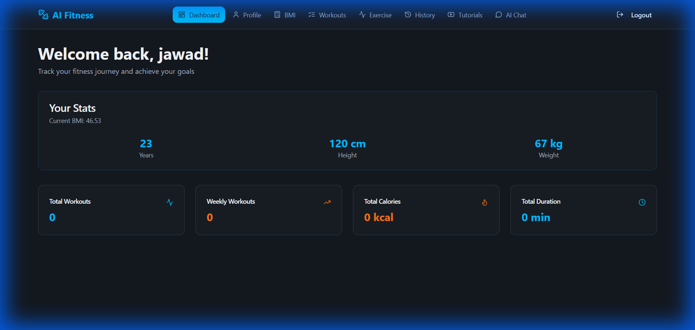

**2. AI Fitness Chatbot (Voice Enabled)**
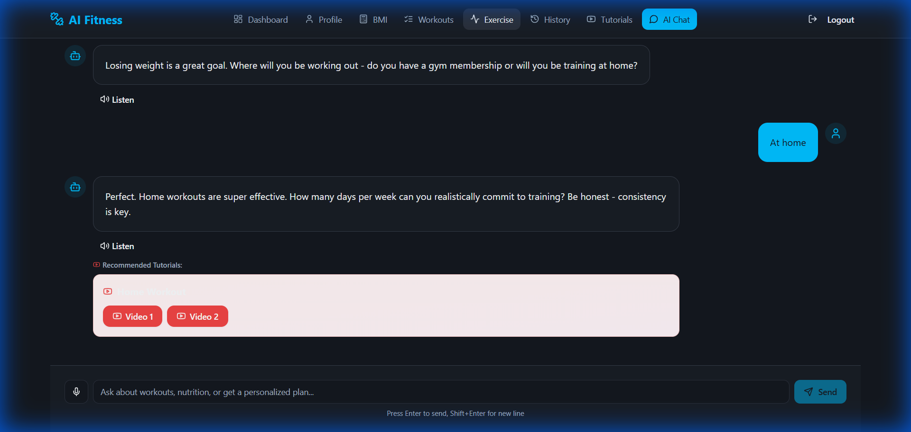

**3. Interactive 3D AI Avatar**
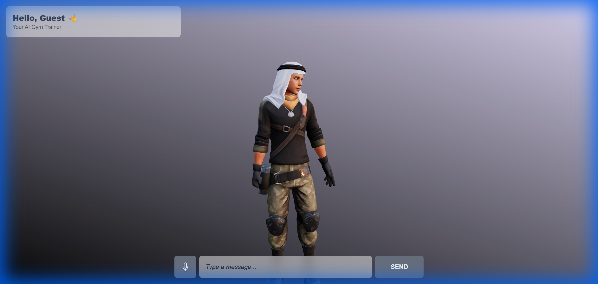

**4. Exercise Tutorials Library**
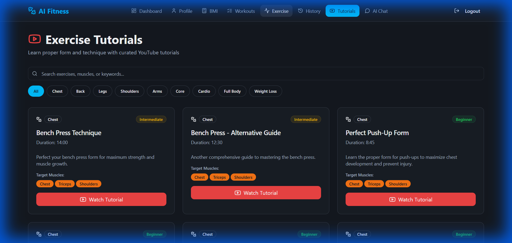

**5. BMI Calculator**
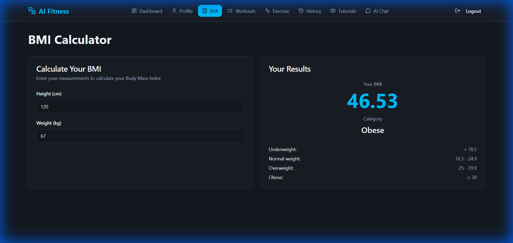

**6. Suggested Workouts**
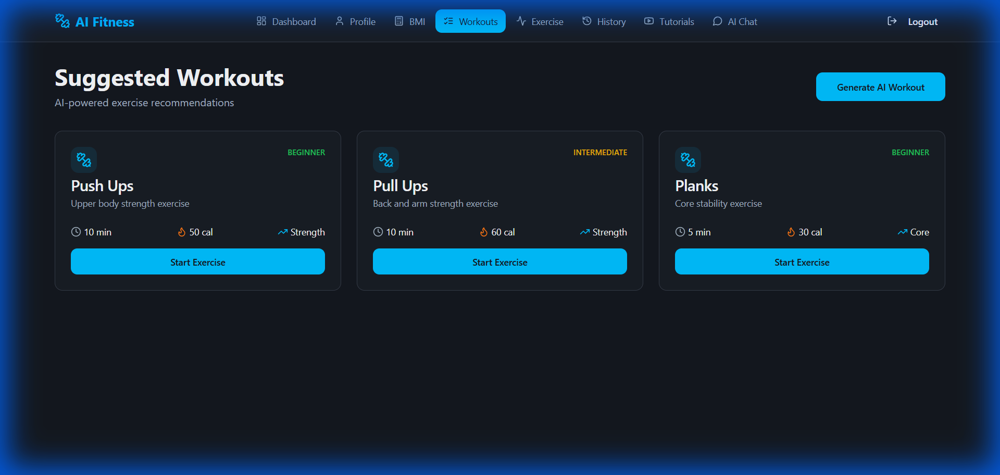

**7. AI Pose Estimation (Perform Exercise)**
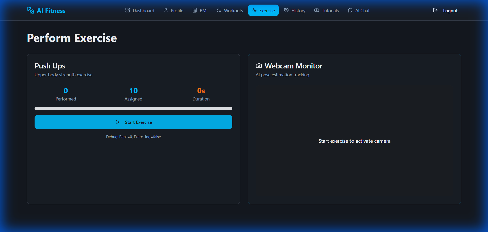

**8. Exercise History & Progress**
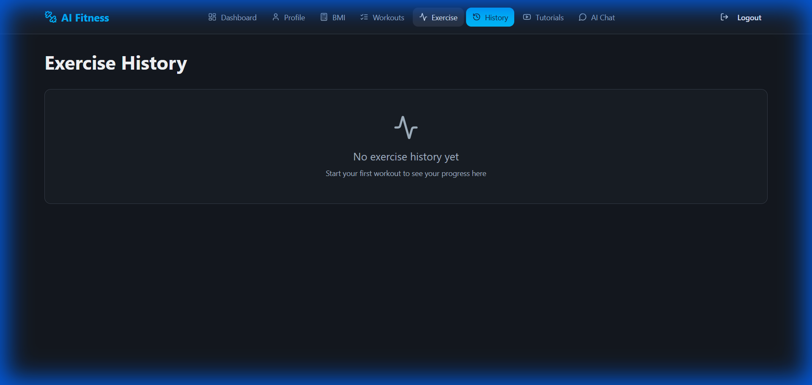

**9. User Profile Management**
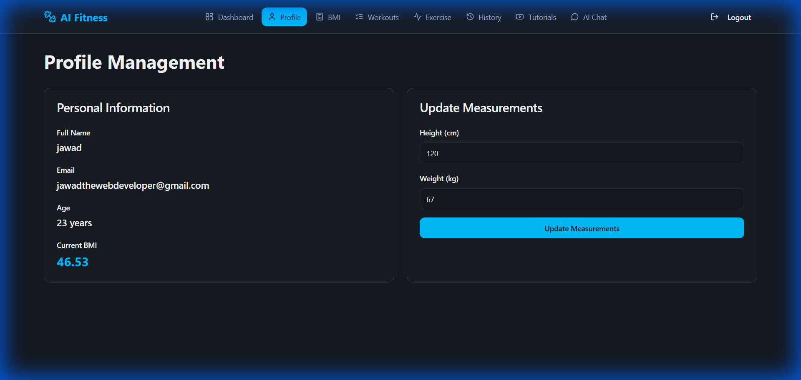

**10. Authentication (Login/Signup)**
<p align="center">
  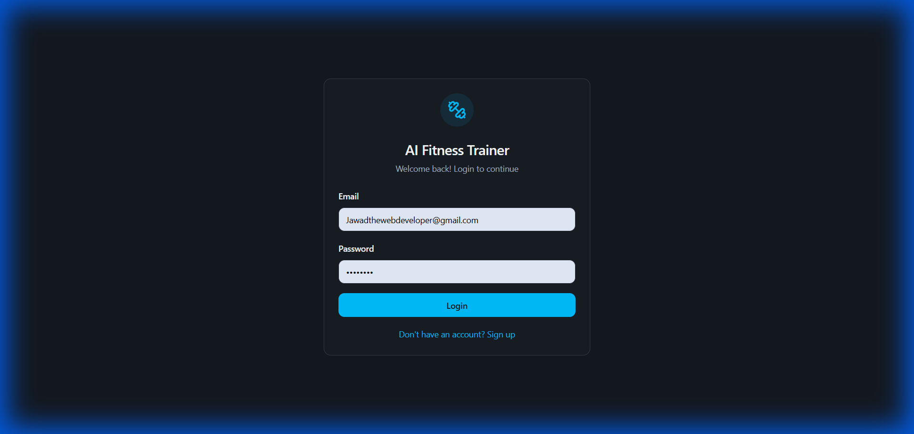
  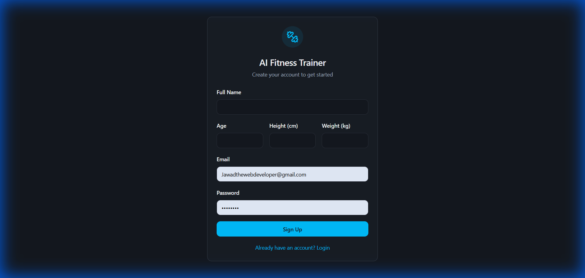
</p>

</div>

### Live Demo
🔗 **Frontend**: [Coming Soon]  
🔗 **Backend API**: https://fitbot-api-cks6.onrender.com/docs
🔗 **Avatar Backend**: https://fitbot-api-cks6.onrender.com/docs

---

## 🛠️ Tech Stack

### Frontend
- **React 18** - UI library
- **TypeScript** - Type safety
- **Vite** - Build tool
- **TailwindCSS** - Styling
- **Shadcn/ui** - Component library
- **Supabase** - Authentication & database

### Backend
- **FastAPI** - Python web framework
- **Groq AI** - LLaMA 3.3 70B model
- **gTTS** - Text-to-speech
- **SpeechRecognition** - Speech-to-text
- **Python 3.8+** - Runtime

### Database
- **Supabase (PostgreSQL)** - User data, profiles, exercise history

---

## 📦 Installation

### Prerequisites
- **Node.js** 18+ and npm
- **Python** 3.8+
- **Git**
- **Supabase Account** (free tier works)
- **Groq API Key** (free at https://console.groq.com)

### 1️⃣ Clone Repository

```bash
git clone https://github.com/JawadAliAI/AI-Fitness-Trainer.git
cd AI-Fitness-Trainer
```

### 2️⃣ Frontend Setup

```bash
# Install dependencies
npm install

# Create .env file
cp .env.example .env

# Add your Supabase credentials to .env
VITE_SUPABASE_URL=your_supabase_url
VITE_SUPABASE_PUBLISHABLE_KEY=your_supabase_key
```

### 3️⃣ Backend Setup

```bash
# Create virtual environment
python -m venv venv

# Activate virtual environment
# Windows:
venv\Scripts\activate
# Mac/Linux:
source venv/bin/activate

# Install dependencies
pip install -r requirements.txt

# Create backend .env file
# Add your Groq API key
GROQ_API_KEY=your_groq_api_key
```

### 4️⃣ Database Setup

1. Go to [Supabase Dashboard](https://supabase.com)
2. Create a new project
3. Go to **SQL Editor**
4. Run the SQL script from `supabase_setup.sql`

### 5️⃣ Run the Application

**Terminal 1 - Backend:**
```bash
uvicorn AIchat:app --reload --port 8000
```

**Terminal 2 - Frontend:**
```bash
npm run dev
```

**Open**: http://localhost:8080

---

## 🎮 Usage

### Getting Started

1. **Sign Up / Login** - Create an account or login
2. **Navigate to AI Chat** - Click "AI Chat" in the navbar
3. **See Welcome Popup** - View features and examples
4. **Start Chatting** - Click an example or type your own message

### Example Conversations

**Weight Loss:**
```
You: "I want to lose weight and build muscle"
FitBot: "That's awesome! Where will you be working out - at home or gym?"
You: "At home"
FitBot: "Perfect! How many days per week can you commit?"
You: "5 days"
FitBot: [Creates personalized 5-day home workout plan with YouTube tutorials]
```

**Muscle Building:**
```
You: "Create a 4-day muscle building plan"
FitBot: [Asks about equipment, experience level, then provides detailed plan]
```

### Voice Features

**Voice Input:**
1. Click the **microphone button** 🎤
2. Speak your message (up to 5 seconds)
3. Text appears in input field
4. Click Send or press Enter

**Voice Output:**
- **Auto-Play ON**: AI responses play automatically
- **Auto-Play OFF**: Click "Listen" button on each message
- Toggle auto-play in the header

### Exercise Tutorials

1. Navigate to **"Tutorials"** in navbar
2. Browse 50+ exercise videos
3. Use **search bar** to find specific exercises
4. Filter by **category** (Chest, Back, Legs, etc.)
5. Click **"Watch Tutorial"** to view on YouTube

---

## 🔌 API Documentation

### Base URL
```
Production: https://fitbot-api-cks6.onrender.com
Local: http://localhost:8000
```

### Endpoints

#### Chat
```http
POST /chat
Content-Type: application/json

{
  "message": "I want to lose weight",
  "user_id": "user123",
  "chat_history": []
}

Response:
{
  "reply": "That's awesome! Where will you be working out?",
  "tutorials": [
    {
      "exercise": "Squats",
      "links": ["https://youtube.com/..."]
    }
  ],
  "chat_history": [...],
  "message_count": 2
}
```

#### Get Tutorials
```http
GET /tutorials

Response:
{
  "total_exercises": 20,
  "exercises": [...]
}
```

#### Text-to-Speech
```http
POST /tts
Content-Type: application/json

{
  "text": "Hello, welcome to FitBot!",
  "language_code": "en"
}

Response: audio/wav file
```

#### Speech-to-Text
```http
POST /stt
Content-Type: multipart/form-data

file: audio.wav

Response:
{
  "transcript": "I want to lose weight"
}
```

**Full API Docs**: https://fitbot-api-cks6.onrender.com/docs

---

## 📁 Project Structure

```
fitbot-ai-fitness/
├── src/                          # Frontend source
│   ├── components/              # React components
│   │   └── Navbar.tsx
│   ├── pages/                   # Page components
│   │   ├── AIChatbot.tsx       # AI Chat interface
│   │   ├── ExerciseTutorials.tsx
│   │   ├── Dashboard.tsx
│   │   └── ...
│   ├── integrations/           # Third-party integrations
│   │   └── supabase/
│   └── App.tsx                 # Main app component
├── AIchat.py                    # FastAPI backend
├── requirements.txt             # Python dependencies
├── package.json                 # Node dependencies
├── supabase_setup.sql          # Database schema
├── .env.example                # Environment template
├── docs/                       # Documentation
│   ├── SETUP.md
│   ├── API.md
│   └── screenshots/
└── README.md                   # This file
```

---

## 🔐 Environment Variables

### Frontend (.env)
```env
VITE_SUPABASE_URL=your_supabase_project_url
VITE_SUPABASE_PUBLISHABLE_KEY=your_supabase_anon_key
```

### Backend (.env)
```env
GROQ_API_KEY=your_groq_api_key
```

---

## 🚀 Deployment

### Frontend (Vercel/Netlify)
```bash
# Build for production
npm run build

# Deploy to Vercel
vercel deploy

# Or Netlify
netlify deploy --prod
```

### Backend (Render)
1. Create new Web Service on Render
2. Connect your GitHub repository
3. Set build command: `pip install -r requirements.txt`
4. Set start command: `uvicorn AIchat:app --host 0.0.0.0 --port $PORT`
5. Add environment variable: `GROQ_API_KEY`

---

## 🤝 Contributing

Contributions are welcome! Please follow these steps:

1. **Fork** the repository
2. **Create** a feature branch (`git checkout -b feature/AmazingFeature`)
3. **Commit** your changes (`git commit -m 'Add some AmazingFeature'`)
4. **Push** to the branch (`git push origin feature/AmazingFeature`)
5. **Open** a Pull Request

### Development Guidelines
- Follow existing code style
- Write meaningful commit messages
- Add tests for new features
- Update documentation

---

## 📝 License

This project is licensed under the **MIT License** - see the [LICENSE](LICENSE) file for details.

---

## 👥 Authors

**Jawad Ali**
- GitHub: [@JawadAliAI](https://github.com/JawadAliAI)
- Email: jawadaliyousafzai.ai

---

## 🙏 Acknowledgments

- **Groq** - For the amazing LLaMA 3.3 70B AI model
- **Supabase** - For authentication and database
- **Shadcn/ui** - For beautiful UI components
- **YouTube** - For exercise tutorial content
- **FastAPI** - For the excellent Python framework

---

## 📊 Stats


---

## 🔮 Roadmap

- [ ] Mobile app (React Native)
- [ ] Workout video player integration
- [ ] Progress tracking charts
- [ ] Social features (share workouts)
- [ ] Meal planning module
- [ ] Wearable device integration
- [ ] Offline mode
- [ ] Multi-language support

---

<div align="center">

**Made with ❤️ and 💪 by the FitBot Team**

[⬆ Back to Top](#-fitbot---ai-fitness-assistant)

</div>
